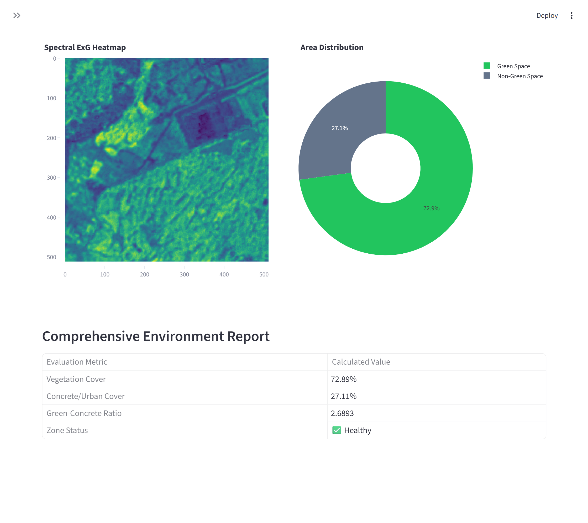

# 🌿 Urban Green Space Analysis Pipeline

## 🎯 Objective
To quantify urban green spaces accurately using aerial imagery and Machine Learning/Deep Learning, assisting in urban planning and environmental sustainability.

## 📸 Dashboard Output


## ✨ Features
- **Spectral Indexing**: Utilizes Green Leaf Index (GLI) and Excess Green (ExG) transformations to automatically isolate vegetation mapping.
- **Unsupervised Learning**: Implements K-Means clustering to distinguish between structures, soil, and vegetation purely by color features.
- **Supervised Learning**: Integrates Random Forest and Support Vector Machines (SVM) for robust structural boundary recognition.

## 📊 Outputs
- Automated green cover percentages given a target aerial image.
- Visual segmented maps highlighting vegetation zones.
- Model evaluation and accuracy metrics for analysis.





## 🧠 Model Comparisons & Theory
The pipeline uses multiple approaches to isolate vegetation and evaluate performance:

1. **Thresholding (ExG)**
   - *Theory*: ExG isolates the green wavelength while penalizing red and blue channels, capturing the physical properties of chlorophyll.
   - *Pros/Cons*: Extremely fast and interpretable, but struggles with deep shadows and dark soil.

2. **Unsupervised Clustering (K-Means)**
   - *Theory*: Maps properties directly into `k` regions by minimizing variance.
   - *Pros/Cons*: Groups general colors very well without needing target labels, but requires post-processing map translation to specific semantic labels.

3. **Supervised Classification (Random Forest & SVM)**
   - *Theory*: Creates non-linear decision boundaries trained directly on features like RGB + HSV + GLI context.
   - *Pros/Cons*: Provides the highest tracking accuracy (ignoring local shadows/dirt patches) but demands extra computational steps. Random Forest handles non-linear boundaries gracefully using ensembles of decision trees.


## 🚀 Setup and Installation

### Prerequisites
Make sure you have Python 3.8+ installed.

1. **Navigate to the Project Directory**:
   ```bash
   cd Urban_Green_Space
   ```

2. **Install Dependencies**:
   ```bash
   pip install streamlit opencv-python numpy scikit-learn pandas matplotlib seaborn plotly pillow jupyter
   ```

3. **Run the Streamlit Dashboard**:
   ```bash
   streamlit run app.py
   ```

4. **Run the Data Science Notebook (Optional)**:
   ```bash
   jupyter notebook main.ipynb
   ```

